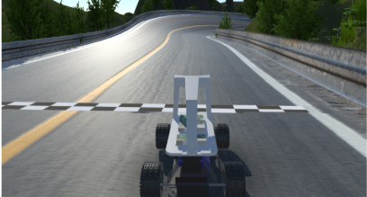

# Comparative Analysis of Deep Reinforcement Learning Algorithms for Autonomous Driving in Simulation



This project aims to implement and compare the performance of three deep reinforcement learning (DRL) algorithms—Proximal Policy Optimization (PPO), Deep Deterministic Policy Gradient (DDPG), and Twin Delayed Deep Deterministic Policy Gradient (TD3)—for training an autonomous agent to complete laps in the Donkey Car simulator. The goal is to assess which algorithm is most effective for continuous control in autonomous driving environments.

- Donkey Car simulator for realistic self-driving experiments
- PPO, DDPG, and TD3 algorithms for autonomous driving tasks
- Actor-critic architecture, experience replay, and target networks for stable training

# Reinforcement Learning on Donkey Car Simulator

## Setup

1. Clone our repository into a folder. 
2. Follow the setup instructions provided here (https://github.com/tawnkramer/gym-donkeycar/releases) and extract the simulator into our repository. 
3. Install the dependencies by
```
pip install -r .\requirements.txt
```
4. Replace SIM_PATH in .env file with path of simulator

## How to Run the Code
Navigate to the RL_algorithms directory and to run any of the alogithms inside the directory run -> **python "filename" --sim "SIM_PATH" --test --gui** in the terminal.

## Algorithm Implementation

The implementation includes three DRL algorithms:

- **Proximal Policy Optimization (PPO)** for on-policy training with CNNs for visual input.
- **Deep Deterministic Policy Gradient (DDPG)** using an actor-critic architecture for continuous action spaces.
- **Twin Delayed DDPG (TD3)** for addressing overestimation biases and improving training stability.

Ensure you have the necessary configurations and environment variables set for running the simulation.

## Modules

| **Directory**      | **Description**                                                            |
|--------------------|----------------------------------------------------------------------------|
| `Results`      | Results of our trained model |
| `RL_algorithms/PPO`          | PPO implementation for autonomous driving in Donkey Car simulator          |
| `RL_algorithms/DDPG`         | DDPG implementation for autonomous driving in Donkey Car simulator         |
| `RL_algorithms/TD3`          | TD3 implementation for autonomous driving in Donkey Car simulator          |
| `RL_algorithms/gym_dokeycar`    | Integration code for Donkey Car simulator and environment setup            |
| `Hyperparameter_trainings`        | Different Algorithms trained with various hyperparameters            |

## Contributors

- Rishabh Kumar
- Rohit Kothawale
- Rucha Pendharkar 
- Santrupti Patil
- Yash Phalle
      
